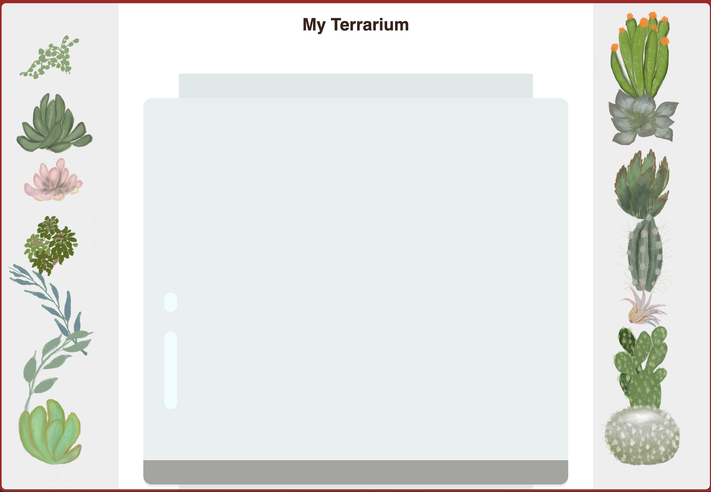
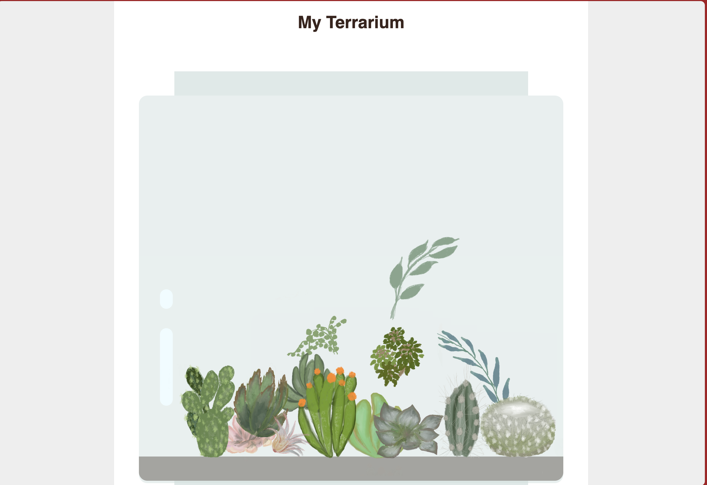
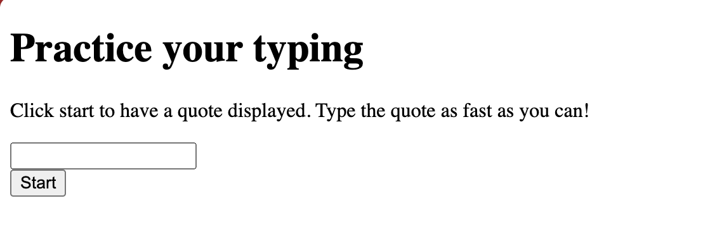
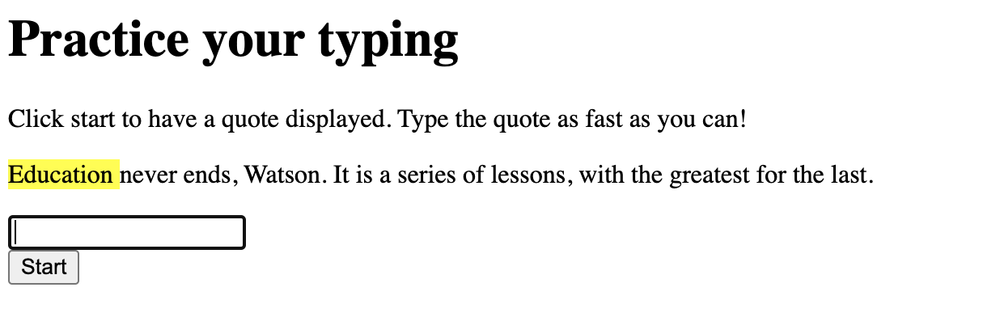
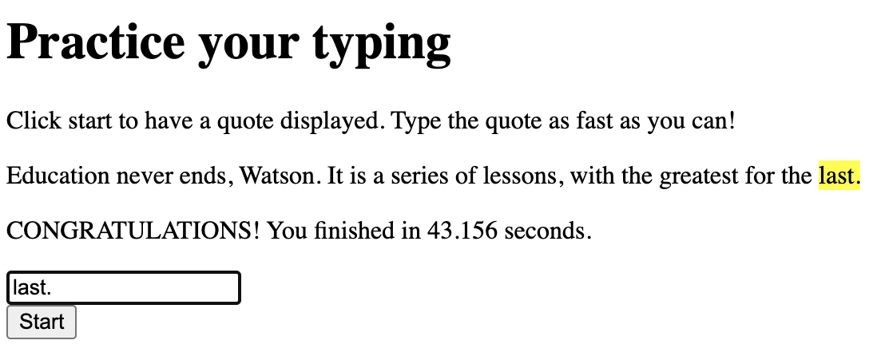
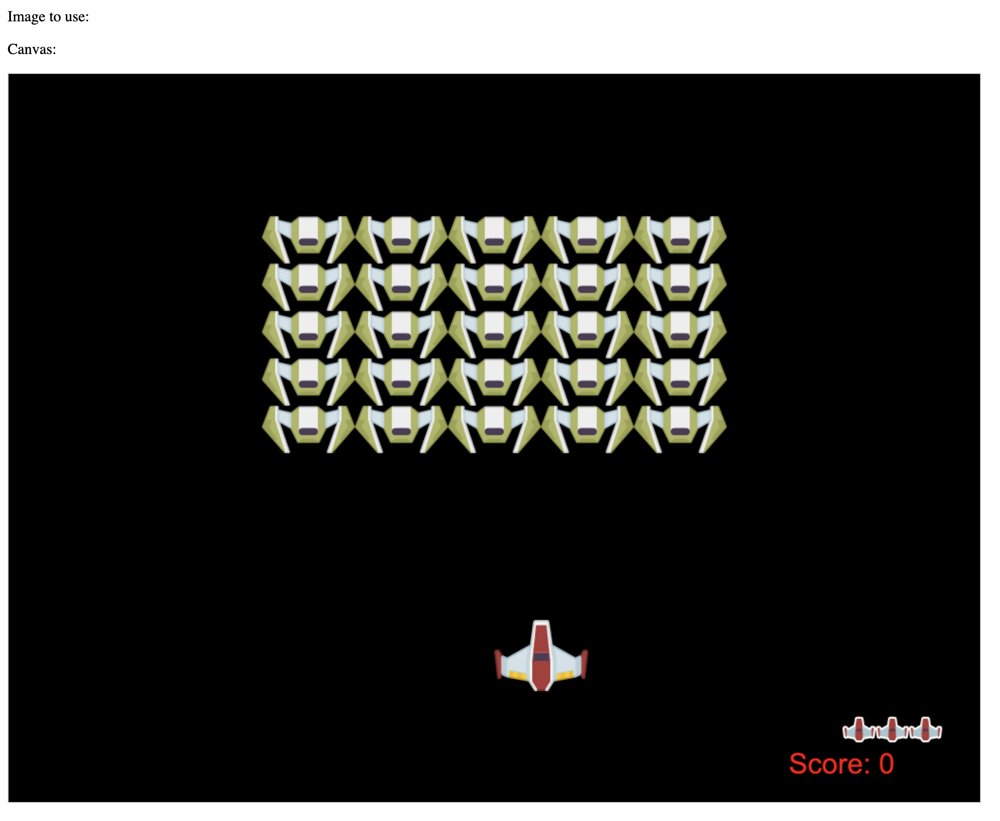
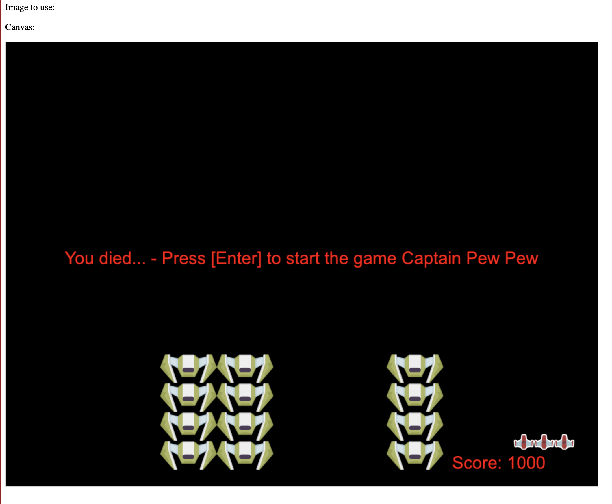

# Welcome, Learner!

This is the repository for the LinkedIn Learning course HTML, CSS, and JavaScript: Building the Web. The full course is available from [LinkedIn Learning][lil-course-url].

## Quickstart

This repository is instrumented with a _`devcontainer.json`_ that provides a pre-defined development environment for this course. To get started:

1. Fork this repository to your GitHub account, to get an editable version.
1. Click the `Code` dropdown in your forked version in the browser.
1. Select the `Codespaces` tab and create a new GitHub Codespaces instance from `main`.

You should see a new GitHub Codespaces session launch in a new browser tab with a built-in Visual Studio Code editor for interactive development. Wait till setup completes and a terminal prompt is seen.

Preview the instructions for the course exercises using this command:

```bash
mkdocs serve
```

## Project Solutions

This LinkedIn course is based on a subset of the materials available in the [Web Dev For Beginners](https://github.com/microsoft/web-dev-for-beginners) curriculum from Microsoft. Please visit that repository to explore additional projects and exercises for self-guided learning.

In this LinkedIn course, we walk through three of the sample projects from that curriculum (replicated locally under `solutions/` for convenience) in a series of instructor-led videos. Read on for a brief description of each.

### Project 1: Terrarium

Learn to construct a digital terrarium using HTML (structure) and CSS (style). Then use JavaScript (interactivity) to support a _drag and drop_ capability that allows users to re-arrange the various plants within the terrarium, to suit their preference.

> Want to preview the application? Try the following commands:

```bash
# Change to the Terrarium Directory
cd solutions/01-terrarium

# Run a webserver on a specific port (5000)
python -m http.server 5000
```

You should see a pop-up giving you the option to "Open in browser" to preview the application. Continue, and you should see something like this:

| Render The Terrarium                            | Rearrange The Plants                             |
| :---------------------------------------------- | :----------------------------------------------- |
|  |  |

### Project 2: Typing Game

Build a simple game that tests the accuracy and speed of your typing. Along the way, you'll learn about the publish-subscribe (pubsub) pattern for tracking and handling real-time events for building engaging games.

> Want to preview the application? Try the following commands:

```bash
# Change to the Terrarium Directory
cd solutions/02-typing-game

# Run a webserver on a specific port (5001)
python -m http.server 5001
```

You should see a pop-up giving you the option to "Open in browser" to preview the application. Continue, and you should see something like this:

|                                     |
| :---------------------------------: |
|  |
|   |
|     |

### Project 3: Space Game

Build a more complex 2D game using advanced HTML elements like `canvas` and advanced JS concepts like _async/await_. Understand how to implement game logic and behaviors like _collision detection_ to create rich interactive user experiences.

> Want to preview the application? Try the following commands:

```bash
# Change to the Terrarium Directory
cd solutions/03-space-game

# Run a webserver on a specific port (5001)
python -m http.server 5002
```

You should see a pop-up giving you the option to "Open in browser" to preview the application. Continue, and you should see something like the rendered terrarium below.

|                                         |
| :-------------------------------------: |
|  |
|    |

---

[0]: # "Replace these placeholder URLs with actual course URLs"
[lil-course-url]: https://www.linkedin.com/learning/
[lil-thumbnail-url]: http://
